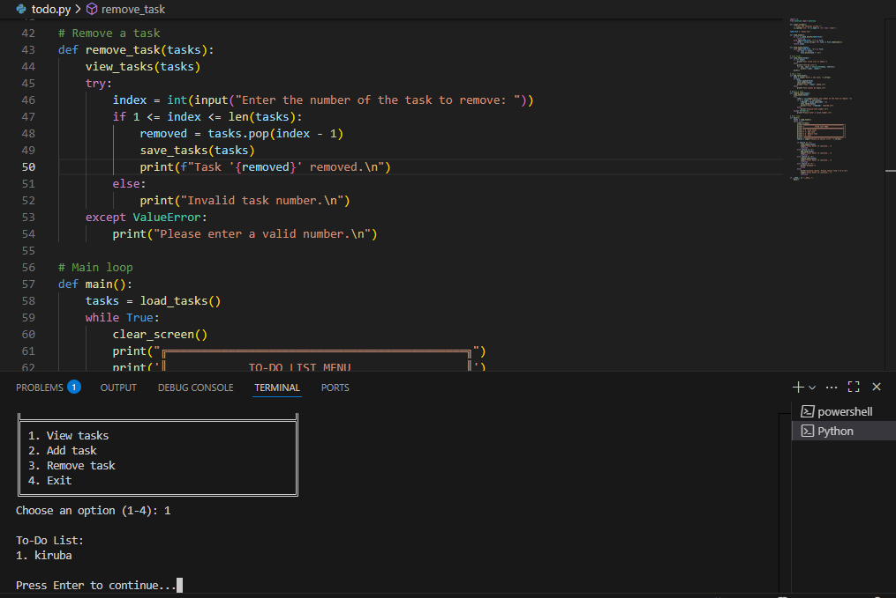
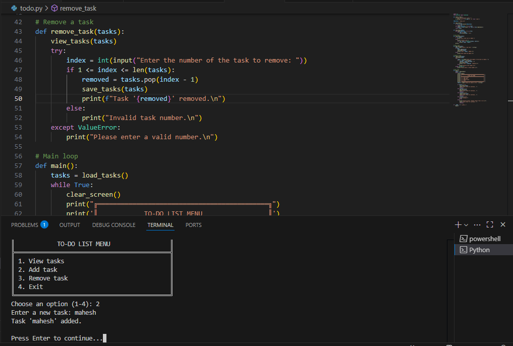
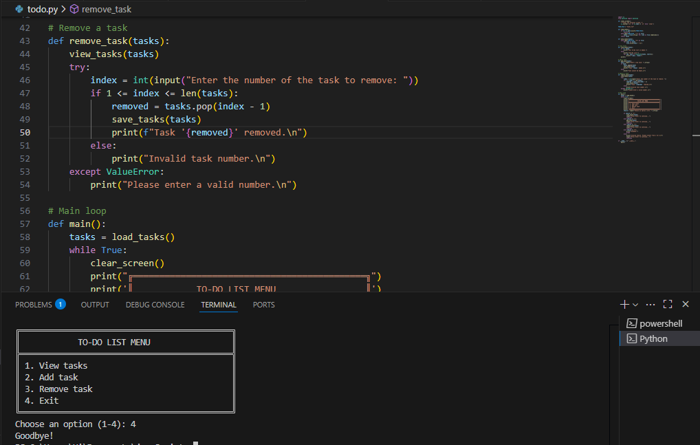

  Task2-To-Do-List
 ===================
 To-Do List Application (Console-Based)
A simple and persistent Command-Line To-Do List app written in Python.
Tasks are stored in a local text file (tasks.txt) to retain data between sessions.
Perfect for productivity via the terminal in VSCode or any console.

🚀 Features
------------------

✅ View tasks in a numbered list

➕ Add tasks with a simple prompt

❌ Remove tasks by selecting task number

💾 Persistent storage using tasks.txt

🧼 Screen clearing for clean UI experience

🖥️ Designed for Windows, Linux, and macOS

📂 Files
-----------
todo.py — Main application script

tasks.txt — Auto-generated file to store your task list

▶️ How to Run
----------------
Requirements
Python 3.x

Works best in VSCode terminal or any standard command-line interface

Steps
Clone or download this repository.

Open the folder in VSCode or a terminal.

Run the script:

bash
Copy
Edit
python todo.py

📷 Screenshots
---------------

╔════════════════════════════════════════════╗
║            TO-DO LIST MENU                 ║
╠════════════════════════════════════════════╣
║ 1. View tasks                              ║
║ 2. Add task                                ║
║ 3. Remove task                             ║
║ 4. Exit                                    ║
╚════════════════════════════════════════════╝
Choose an option (1-4):

📄 Example tasks.txt (auto-created)
-------------------------------------
Copy
Edit
Buy groceries
Read Python book
Call Alice

📌 Notes
----------

The UI automatically clears the screen between actions for a cleaner experience.

Tasks are plain strings. No priority, deadline, or categorization yet.

The script works offline and doesn't use any external libraries.

💡 Future Improvements (Optional Ideas)
---------------------------------------
Add task deadlines or priorities

Mark tasks as done/undone

Use JSON for structured task storage

Add search/filtering options

Add support for editing tasks

📃 License
-------------
This project is provided as-is with no warranty. Feel free to modify and reuse it for personal or educational purposes.

